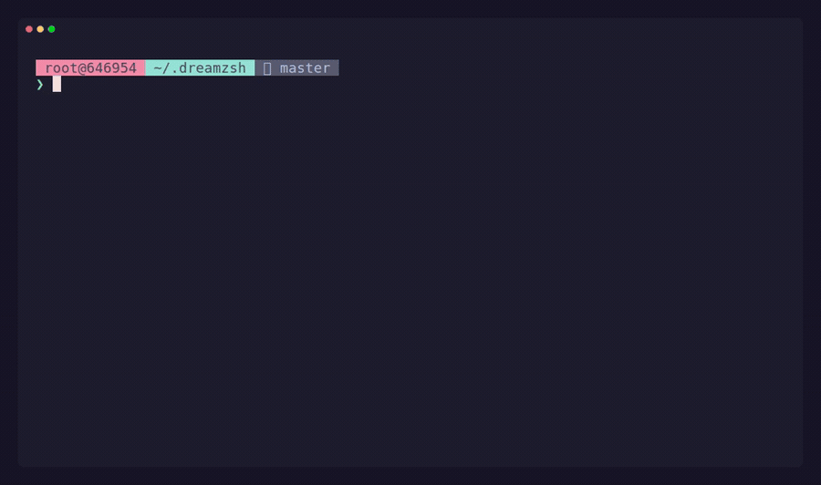

<p align="center">
  <a href="README.md">English</a> · <strong>Русский</strong>
</p>

<div align="center">

# ✨ DreamZSH

### Настройка Zsh через понятный CLI

Плагины, темы и переносимые профили без ручного редактирования конфига.

[](https://github.com/BoyToyDev/dreamzsh/actions/workflows/ci.yml)
[](LICENSE)
[](https://www.zsh.org/)

[Быстрый старт](#-быстрый-старт) · [Плагины](#-плагины) · [Профили](#-переносимые-профили) · [Команды](#-карта-команд)



</div>

## Зачем DreamZSH?

- Управление оболочкой через понятные команды и автодополнение по TAB.
- Включение, отключение, просмотр и обновление плагинов без правки `.zshrc`.
- Установка плагинов из официального каталога и совместимых Git-репозиториев.
- Самодостаточные профили с темами и snapshots сторонних плагинов.
- Атомарное сохранение настроек и проверяемый импорт профилей.
- Небольшое читаемое ядро на Zsh без закрытого формата конфигурации.

> Сейчас DreamZSH разрабатывается и тестируется для Linux. Поддержка macOS пока
> не является целью проекта.

## 🚀 Быстрый старт

```zsh
git clone https://github.com/BoyToyDev/dreamzsh.git ~/.dreamzsh
zsh ~/.dreamzsh/install.sh
```

Интерактивный установщик проверяет Zsh, умеет предложить его установку через
поддерживаемый пакетный менеджер Linux и смену login shell. После установки:

```zsh
exec zsh
dreamzsh doctor
```

CLI можно изучать без запоминания команд:

```text
dreamzsh <TAB><TAB>
dreamzsh plugin <TAB><TAB>
dreamzsh theme preview <TAB><TAB>
```

## 🧩 Плагины

### Встроенные плагины

```zsh
dreamzsh plugin list
dreamzsh plugin enable git history
dreamzsh plugin disable history
dreamzsh plugin info git
```

Отключённый плагин остаётся установленным и может входить в профили.

### Официальный каталог

Официальный [каталог плагинов DreamZSH](https://github.com/BoyToyDev/dreamzsh-plugins)
встроен в систему. Он загружается автоматически при первом вызове `browse`,
`info` или `install` — предварительно добавлять репозиторий не требуется.

```zsh
dreamzsh plugin browse
dreamzsh plugin info <name>
dreamzsh plugin install <name>
```

Установка сразу включает плагин. Если проверка зависимостей или включение не
удались, DreamZSH откатывает установку.

### Дополнительные каталоги и Git-репозитории

```zsh
dreamzsh plugin repo add owner/repository
dreamzsh plugin repo list
dreamzsh plugin repo update --all
dreamzsh plugin repo remove repository

dreamzsh plugin install owner/plugin
dreamzsh plugin install https://github.com/owner/plugin.git
```

Метаданные registry читаются как данные и не исполняются. Кэш каталогов,
установка и обновление плагинов выполняются атомарно.

## 🎨 Темы

```zsh
dreamzsh theme list
dreamzsh theme preview dream-mini
dreamzsh theme set dream-powerline
dreamzsh theme current
```

`preview` показывает тему без сохранения, а `set` делает её активной.

## 📦 Переносимые профили

Профиль может содержать активную тему, дополнительные темы, включённые плагины
и snapshots сторонних плагинов. Такой набор можно воспроизвести и передать без
зависимости от доступности исходных репозиториев.

```zsh
dreamzsh profile export My_super_profile
dreamzsh profile import ./My_super_profile.tar.gz
dreamzsh profile apply My_super_profile
```

Перед изменением локальных данных импорт проверяет пути и SHA-256 checksums.

## 🗺️ Карта команд

| Задача | Команда |
|---|---|
| Проверить установку | `dreamzsh doctor` |
| Показать состояние | `dreamzsh status` |
| Посмотреть официальный каталог | `dreamzsh plugin browse` |
| Установить и включить плагин | `dreamzsh plugin install <name>` |
| Включить установленный плагин | `dreamzsh plugin enable <name>` |
| Посмотреть тему | `dreamzsh theme preview <name>` |
| Экспортировать профиль | `dreamzsh profile export <name>` |
| Перезапустить текущую оболочку | `dreamzsh reload` |
| Показать статистику запуска | `dreamzsh stats` |
| Обновить DreamZSH | `dreamzsh update` |

У каждой команды есть отдельная справка:

```zsh
dreamzsh help plugin
dreamzsh plugin install --help
dreamzsh profile export --help
```

## 🛠️ Создание расширений

```zsh
dreamzsh plugin create my-plugin
dreamzsh theme create my-theme
```

Структура плагина для каталога:

```text
plugins/plugin-name/
├── plugin.zsh
├── plugin.meta
└── README.md
```

В метаданных зависимости от плагинов DreamZSH и системных команд разделены на
`requires_plugins` и `requires_commands`.

## 🧪 Надёжность

В проекте используются изолированные smoke-тесты CLI, тесты lifecycle hooks и
зависимостей, тесты registry с локальными Git-репозиториями, тесты установщика,
синтаксическая проверка Zsh и Linux CI. Изменения конфигурации и обновления
ресурсов не должны оставлять систему в частично изменённом состоянии.

## 📼 Пересборка демонстрации

Анимация README воспроизводимо создаётся через [VHS](https://github.com/charmbracelet/vhs):

```zsh
vhs docs/demo.tape
```

## Планы

- Наполнение официального каталога плагинов.
- Улучшение диагностики зависимостей и переносимости профилей.
- Новые темы и документация по созданию расширений.
- Управление самообновлением и необязательный lazy loading после проработки дизайна.

История разработки находится в [CHANGELOG.ru.md](CHANGELOG.ru.md). Мы рады
небольшим целевым изменениям и подробным сообщениям об ошибках.

## Лицензия

[MIT](LICENSE)
